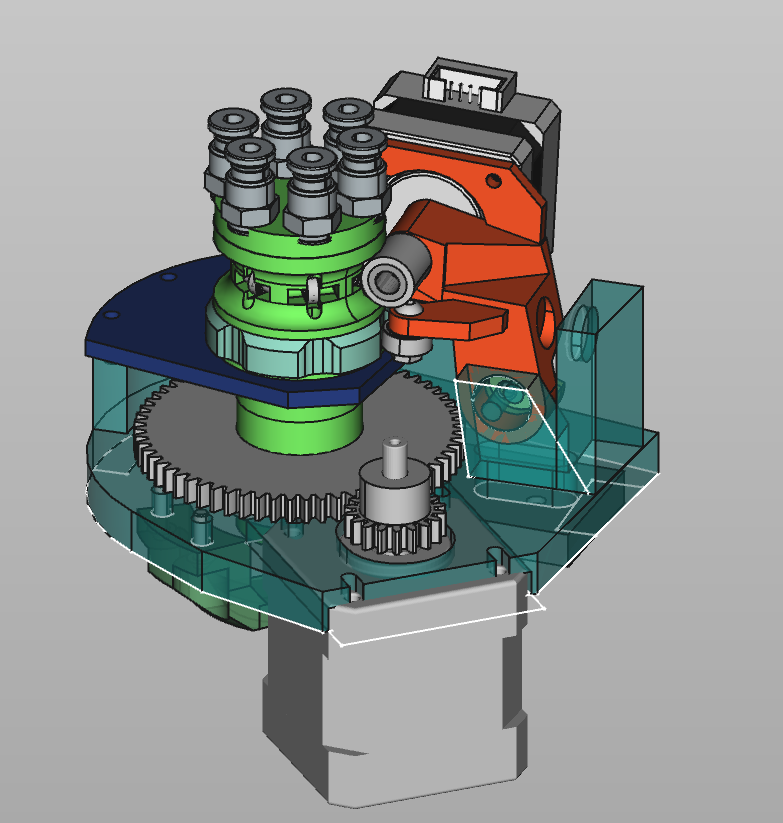
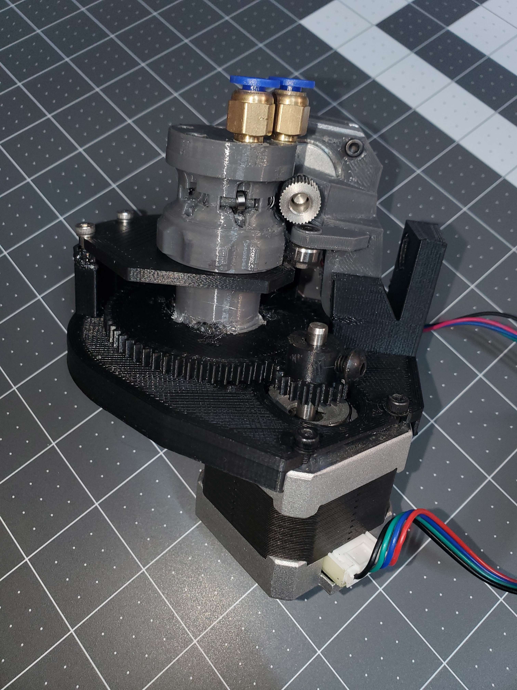

# A Rotary Multi-Material Addon for Your 3D Printer
A WIP Multi-Material Upgrade designed to be simpler, easier to build, and more reliable. The models are developed in FreeCAD and I've been testing with printers running Klipper firmware. 

**The sell**: Have you SEEN how much work it is to assemble the linear MMUs? Have you _seen_ the mess of filament they spit out backwards? And their solution to the spagetti is to build _yet another_ complicated mechanism to keep the slack filament under control! What if there was an easier way? What if there was a sleek, straightforward, compact, easy to assembly, easy to maintain, no-nonsense multi-material addon for any 3d printer? The printer never stops, all the firmware is extremely straightforward, the tolerances are low, the electronics are simple, it can easily be mounted in a small space, the bill of materials is short and cheap, it's easy to manufacture out of metal, what more could you want? 

- Few parts counts (Only 3 bearings, no linear rails)
- Fast assembly, there are only 3 major components to the build.
- Way more compact than any other multi-material system
- Handles way more filament paths than any other multi-material system
- Doesn't require additional hardware such as a filament-rewinder or special filament enclosure

# More details
A filament strand only engages with the feed gear when the cam bearing allows the spring-tensioned lever to sink and engage. Once this happens, the feed motor can quickly feed the filament either way. This removes the need for a fancy magnetic or gated solution to prevent accidental filament feeding. This may even work as an extruder by itself, replacing an existing bowden setup.

The two actuators are mounted on a frame capable of rotating around the filament pathways. Or, the actuators could be held in place and the filament runs could be rotated. I think wire management will be easier than managing the filament wrapping around itself. I don't think going around 360+ degrees is a good idea, the wires would wrap up, it should be limited to only rotate once, ~350degrees. 

# Status
Right now (as of August, 6th, 2023), I've gotten the basic prototype build working as a standalone device. I have not yet completed a test print because I'm still having issues with reliablility. Notably, I was having the carousel stepper skip steps while trying to cut the filament. The gearing ratio has been improved to help with that, but I haven't tested that yet. The filament feed mechanism needs to be pulled with like four springs in order for it to feed filament even sort of reliably, though I can work around this for the most part. The biggest issue is when the filament is sliced and then it tries to feed new filament into the exit tube; the filament often gets caught in the pneumatic fitting or the print itself. Will need to embed a bowden tube into the print to help with this. Hopefully with the most recent changes, the unit will be reilable enough to start test printing. I still have to figure out slicer settings, but I can just add a klipper macro GCODE for filament changes when I get there. 

### Firmware
I exclusively use klipper with my printers, and it has some nice utilities to set this up. I have a second motherboard dedicated to just running the MMU and klipper has it attached as a secondary MCU. I use 'MANUAL_STEPPER' for the carousel/magazine stepper and a second extruder motor instance for the feed stepper. The feed stepper can be syncronized with the primary extruder stepper for normal operation, and then made indepentant when feeding forward new filament after the old filament is sliced. To perfectly optimize this process, it would probably require writing some python code and a subroutine in klipper, but using the existing tools seems to work just fine. I have a couple macros in my testing setup for each action the MMU can take. 

The modified klipper firmware would be useful for features like automatically preventing filament tangles (instead of just rotating around constantly and wrapping up the filaments). It would also be good for splicing in new filament without interrupting a print, so the print head would always keep moving (it may need to pause for a fraction of a second while the filament is sliced). It would probably also be useful for automatically adjusting print parameters for individual filaments, and other more advanced utilities. 

## TODO
- ~~Change gears to printable gears~~
- ~~Add spring mounting point~~
- Reinforce lever arm (a lot)
- ~~Add filament exit to pivot frame~~
- ~~Finish filament paths~~
- ~~Add filament knife to pivot frame(?)~~
(06/10/23)
- Big carousel gear needs to be keyed to shaft
- Switch to better filament feed gear (why is amazon full of just really terrible feed gears?)
- Improve printability of exit funnel
- Re-design lever for more leverage and less twisting (move pivot point inline with cam bearing)
- Develop better klipper integration
- TEST PRINT!
- Add homing switch
- Add optional full-rotaton stop to prevent filament tangles (might be one in the same with a the homing switch)
- Include mounting point options on the pivot frame
- Investigate better filament feeding mechanism; for direct bowden printing. (Needs larger carousel)
- Improve printability of all parts for final deployment of Version 1.
- Finalize prototype BOM

### Other names/tags/search terms
Filament carousel, rotating MMU, no slide MMU, multi-material mod.
