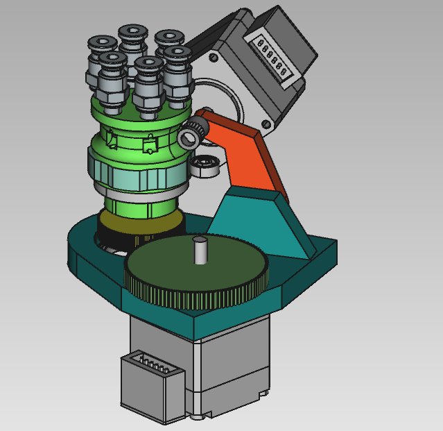

# A Rotary Multi-Material Addon for Your 3D Printer
A WIP Multi-Material Upgrade designed to be simpler, easier to build, and more reliable.

**The sell**: Have you SEEN how much work it is to assemble the linear MMUs? Have you _seen_ the mess of filament they spit out backwards? And their solution to the spagetti is to build _yet another_ complicated mechanism to keep the slack filament under control! What if there was an easier way? What if there was a sleek, straightforward, compact, easy to assembly, easy to maintain, no-nonsense multi-material addon for any 3d printer? The printer never stops, all the firmware is extremely straightforward, the tolerances are low, the electronics are simple, it can easily be mounted in a small space, the bill of materials is shorter and cheaper, it's easier to manufacture out of metal, what more could you want? 

# More details
A filament strand only engages with the feed gear when the cam bearing allows the spring-tensioned lever to sink and engage. Once this happens, the feed motor can quickly feed the filament either way. This removes the need for a fancy magnetic or gated solution to prevent accidental filament feeding. This may even work as an extruder by itself, replacing an existing bowden setup. 

The two actuators are mounted on a frame capable of rotating around the filament pathways. Or, the actuators could be held in place and the filament runs could be rotated. I think wire management will be easier than managing the filament wrapping around itself. I don't think going around 360+ degrees is a good idea, the wires would wrap up, it should be limited to only rotate once, ~350degrees. 

## Notes & Planning

The mockup does not include the feed outlet, which I intend to have include only one hole, which can have a knife sever the filament as the frame rotates. If the filament is severed, the printer doesn't have to stop printing in order to have the next filament fed in. An off-the-shelf filament encoder can serve as a feed and check sensor.

It looks like 6 filament guides is easy enough, though it also looks like you could add many many many many more without changing the design much. It's pretty much just getting the fittings to... fit... on top & bottom. 

## TODO
- Change gears to printable gears
- Add spring mounting point
- Reinforce lever arm (a lot)
- Add filament exit to pivot frame
- Finish filament paths
- Add filament knife to pivot frame(?)
- Finalize prototype BOM
- 
### Other names/tags/search terms
Filament carousel, rotating MMU, no slide MMU, multi-material mod.
